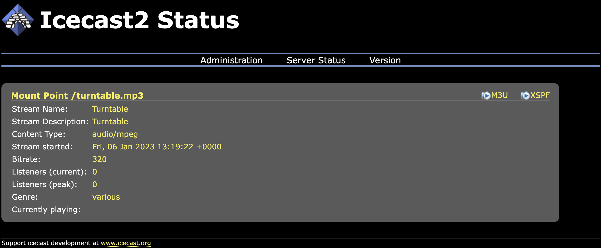

# Turntable to Smart Home Audio (Sonos, Bose) or internet radio with Raspberry Pi

Create a internet radio stream that allows for streaming your records to your Sonos
or any other internet radio endpoint like e.g. the TuneIn App on your
smartphone.


## TLDR

1. Set audio device to be streamed in `config/darkice.cfg` file.

   ```cfg
   ...
   device          = plughw:3,0 # Audio device for the audio input
   ...
   ```

   See XXX for details about determining your audio device.

2. Start docker container.

   ```bash
   sudo docker compose up
   ```

The numbering of the audio devices is not deterministic and changes randomly
after a restart.

## Table of Contents

[[_TOC_]]

## Setup and configuration

### Concept

The audio hardware in the households changes drastically and makes use of
technologies like bluetooth or wireless streaming. This goes along with the
removal of physical connectors on the audio devices. As a consequence it becomes
harder if not impossible at the first glimpse to listen to your records on playback devices in your household. This project tackles this problem with the
help of a docker container that creates a live internet radio stream in the
local network from the current playing record. This internet radio stream can be consumed by any internet radio compatible device in the
network. E.g. you can add the created internet radio stream to your smart home
audio system from [Sonos](https://www.sonos.com/de-de/home) or [Bose Home
Audio](https://www.bose.com/en_us/products/speakers/smart_home.html) as well as
any other bluetooth sound system or computer.

### Disclaimer

There are already a couple of projects describing a similar approach [see
section Inspiration](###inspiration). This project attempts to simplify the
setup of such an internet streaming service. Through the dockerization the
resilience is increased.
The presented solution doesn't claim to be the audiophile's choice. Nevertheless
it creates a suitable solution for a growing problem of connectivity problems.
It is also an alternative for expensive solutions like the [Sonos
Amp](https://www.sonos.com/en-us/shop/amp) or the [Bose Music Amplifier](Bose
Music Amplifier).

### Architecture

The pipeline begins with the record player which is connected to the USB audio
interface (see architecture overview above). The analog signal from the current playing record travels through USB
audio interface into the Raspberry Pi. The program
[Darkice](http://www.darkice.org/) encodes the analog audio signal into a
digital audio signal according to your configuration and sends it to a streaming
media server. The streaming media server in this setup is
[Icecast](https://icecast.org/). It creates a internet radio station in your
private network. You can listen to it on any device that allows for the
connection with an internet radio stream.  
To create a similar set up the following steps need to be completed:

1. [Organize Hardware](###hardware).
2. [Prepare Raspberry Pi](###prepare-raspberry-pi).
3. [Install required software](###install-required-software).
4. [Make number of used audio device persistent](###persistent-audio-device-number).
5. [Configure Darkice](###configure-darkice).
6. [Start the container](###start-container).
7. [Test the internet radio stream](###test-the-internet-radio-stream)

### Hardware

1. Record player with stereo out.
2. USB Audio interface with phono preamp e.g.:
   1. [Behringer U-PHONE
      UFO202](https://www.amazon.de/-/en/gp/product/B002GHBYZ0/ref=ppx_yo_dt_b_search_asin_title?ie=UTF8&th=1) (tested).
   2. If your record player has a build in phono preamp or you are using an
      external phono you can also use audio boards from
      [HifiBerry](https://www.hifiberry.com/shop/#boards) (not tested).
3. Raspberry Pi e.g.:
   1. Raspberry Pi 4 2GB Ram (tested).
   2. Other versions should also work.
4. Audio System eg.:
   1. [Sonos](https://www.sonos.com/de-de/home) including [Sonos
      App](https://apps.apple.com/de/app/sonos/id1488977981?l=en) (tested).
   2. Any Bluetooth speaker plus internet radio app e.g.
      [TuneIn](https://tunein.com/) (tested) or similar.
   3. [Bose Home Audio](https://www.bose.com/en_us/products/speakers/smart_home.html) (not
      tested) including [Bose Music
      APP](https://www.bose.de/de_de/apps/bose_music.html) (not tested).

### Prepare Raspberry Pi

Install a linux operating system of you choice e.g.:

1. [Raspberry Pi
   OS](https://www.raspberrypi.com/documentation/computers/getting-started.html)
   (not tested).
2. [Debian](https://wiki.debian.org/RaspberryPi4) (not tested).
3. [Ubuntu](https://ubuntu.com/download/raspberry-pi) (not tested).
4. [CentOS](https://medium.com/@gk.mr/installing-centos-in-raspberry-pi-4-94566309e59f)
   (not tested).
5. [Arch](https://archlinuxarm.org/platforms/armv8/broadcom/raspberry-pi-4) (tested).

**Comments:**

1. I used arch linux for my setup as I like the rolling-release
   approach. If you are new to linux and or to Raspberry Pi I would recommend to
   start with a debian based system like Raspbian, Debian or Ubuntu as the
   explanations are mostly very comprehensible.
2. If you don't know how to access the your Raspberry Pi remotely the following
   guide might give you a good starting point [*Connect to your Raspberry Pi with
   ssh*](https://www.raspberrypi.com/documentation/computers/remote-access.html).
   I would like to encourage you to research this part on your own and keep
   following this guide after you have access to your Raspberry Pi's terminal.

### Install required software

Required programs and packages:

* [Alsa](https://wiki.debian.org/ALSA): API for audio device drivers. No
  installation required as alsa is part of the Linux Kernel.
* [Docker Engine](https://www.docker.com/): Program that allows you to run docker
  containers on your system. Please follow the [installation guide](https://docs.docker.com/engine/install/) from the
  docker homepage.
* [Docker Compose](https://docs.docker.com/compose/): Tool for defining and
  running docker containers. Please follow the [installation
  guide](https://docs.docker.com/compose/install/linux/#install-the-plugin-manually)
  from the docker homepage.
* [git](https://git-scm.com/)Please follow the [installation guide](https://git-scm.com/book/en/v2/Getting-Started-Installing-Git) from git.

### Persistent audio device number

To configure our internet radio stream correctly it is required to inform
darkice about the source of the audio signal that needs to be encoded. The
command `aplay -l` displays a list of known audio devices.

```bash
sudo aplay -l

# Example output:
**** List of PLAYBACK Hardware Devices ****
card 0: Headphones [bcm2835 Headphones], device 0: bcm2835 Headphones [bcm2835 Headphones]
  Subdevices: 8/8
  Subdevice #0: subdevice #0
  Subdevice #1: subdevice #1
  Subdevice #2: subdevice #2
  Subdevice #3: subdevice #3
  Subdevice #4: subdevice #4
  Subdevice #5: subdevice #5
  Subdevice #6: subdevice #6
  Subdevice #7: subdevice #7
card 1: vc4hdmi0 [vc4-hdmi-0], device 0: MAI PCM i2s-hifi-0 [MAI PCM i2s-hifi-0]
  Subdevices: 1/1
  Subdevice #0: subdevice #0
card 2: vc4hdmi1 [vc4-hdmi-1], device 0: MAI PCM i2s-hifi-0 [MAI PCM i2s-hifi-0]
  Subdevices: 1/1
  Subdevice #0: subdevice #0
card 3: CODEC [USB Audio CODEC], device 0: USB Audio [USB Audio]
  Subdevices: 1/1
  Subdevice #0: subdevice #0
```

The example output shows 4 audio cards available on my Raspberry Pi. Relevant
for the internet radio stream program is `card 3` as it is the audio interface
that is connected to the record player. Unlike `card 1` `card 3` has only one
subdevice. Darkice can be configured to listen to `card 3`
and `subdevice 0` by editing the line starting with `device` in `config/darkice.cfg`:

```cfg
...
device          = plughw:3,0 # Audio device for the audio input
...
```

The `3` of `plughw:3,0` represents the card number and the `0` the subdevice. If
you start the docker container now your stream would work until the next restart
of the Raspberry Pi. Unfortunately alsa is indexing the available audio devices
randomly on every reboot. In order to make the system reliable we need to make
the numbering  audio interface persistent. This can be done in various ways as
described [here](https://wiki.archlinux.org/title/Advanced_Linux_Sound_Architecture#top-page)
for arch linux. One approach to resolve this is to set the card number
explicitly in the alsa configuration with the help of the kernel modules.To
determine the kernel module used by the audio device the record player is
connected to follow the steps described below:

1. Unplug the audio device.
2. Restart the Raspberry Pi.
3. List kernel modules. They are listed in the first column of output.

   ```bash
   lsmod | grep snd

   # Example output
   snd_bcm2835            28672  0
   ```

4. Connect the audio device.
5. List the kernel modules again.

   ```bash

   # Example output
   snd_usb_audio         319488  0
   snd_usbmidi_lib        36864  1 snd_usb_audio
   snd_hwdep              20480  1 snd_usb_audio
   snd_rawmidi            45056  1 snd_usbmidi_lib
   snd_bcm2835            28672  0
   snd_seq_device         20480  1 snd_rawmidi
   mc                     61440  4 videodev,snd_usb_audio,videobuf2_v4l2,videobuf2_common
   ```

I assumed that my audio device is using the module `snd_usb_audio`. For the sake
of simplicity I configured alsa such that the audio device is the last card of
the connected cards by editing `/etc/modprobe.d/alsa-base.conf` and set the
index of the card using the module `snd_usb_audio` to 3:

```bash
options snd_usb_audio index=3
```

The persistence of the card number can be tested by rebooting a couple of times
and checking the numbering of the audio interface after each reboot with the
command `sudo aplay -l`. If your card number is always the same keep on with the
configuration of Darkice.

### Configure Darkice

Now it is possible to configure Darkice such that it will keep functioning after
restarts by editing `config/darkice.cfg`:

```cfg
...
device          = plughw:3,0 # Audio device for the audio input
...
```

### Start Container

Last but not least the internet radio streaming container can be started:

```bash
sudo docker compose up
```

This will build the image and start the container. It is configured such that it
restarts anytime the host system is restarted.

### Test the internet radio stream

1. Navigate with your browser to `http://<local ip address of raspberry pi>:8000`
  e.g. `http://192.168.178.43:8000` to check if Icecast is up and running. Here
  you will also see information about your Darkice encoding.

  

2. Try to listen to your local internet radio stream.
   1. Configure a web radio player and point it to your stream. Your Stream url
      is `http://<local ip address of raspberry pi>:8000/turntable.mp3`
  e.g. `http://192.168.178.43:8000/turntable.mp3` e.g.:
      1. [*Add an Internet radio station to Sonos*](https://support.sonos.com/en/article/add-an-internet-radio-station-to-sonos).
      2. [*Add custom url to TuneIn*](https://help.tunein.com/what-if-i-know-a-radio-stations-streaming-url-but-its-not-on-tunein-can-i-still-listen-to-it-HkOxgcC9OwM).
   2. Start a record on your turntable. The ecoding of darkice causes a slight
      delay of a few seconds. Be patient!

## Thanks to

### Inspirations

* [darkice-libaacplus-rpi-guide](https://github.com/basdp/USB-Turntables-to-Sonos-with-RPi)
  by [coreyk](https://github.com/coreyk)
* [basdp](https://github.com/coreyk/darkice-libaacplus-rpi-guide) by [basdp](https://github.com/basdp)
* [Docker Conatiner Audio](https://leimao.github.io/blog/Docker-Container-Audio/)

### Icons used

<a href="https://www.flaticon.com/de/kostenlose-icons/vinyl" title="vinyl Icons">Vinyl Icons erstellt von Pavel Kozlov - Flaticon</a>
<a href="https://www.flaticon.com/free-icons/speaker" title="speaker icons">Speaker icons created by Smashicons - Flaticon</a>
<a href="https://www.flaticon.com/free-icons/raspberry-pi" title="Raspberry Pi icons">Raspberry Pi icons created by Freepik - Flaticon</a>
<a href="https://www.flaticon.com/free-icons/laptop" title="laptop icons">Laptop
icons created by Freepik - Flaticon</a>
<a href="https://www.flaticon.com/free-icons/audio" title="audio icons">Audio icons created by Andrejs Kirma - Flaticon</a>