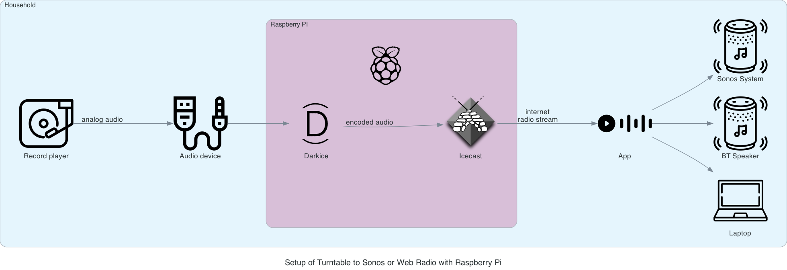

# Turntable to Sonos or Web Radio with Raspberry Pi

Create a web radio stream that allows for streaming your records to your Sonos
or any other web radio endpoint like e.g. the TuneIn App on your smartphone.

## TLDR

1. Set audio device to be streamed in `config/darkice.cfg` file.

   ```cfg
   ...
   device          = plughw:3,0 # Audio device for the audio input
   ```

   See XXX for details about determining your audio device.

2. Start docker container.

   ```bash
   sudo docker compose run --entrypoint "aplay -l" record-stream
   ```

The numbering of the audio devices is not deterministic and changes randomly
after a restart.

## Setup and configuration

### Concept

The audio hardware in the households changes drastically and makes use of
technologies like bluetooth or wireless streaming. This goes along with the
removal of physical connectors on the audio devices. As a consequence it becomes
harder if not impossible at the first glimpse to listen to your records on any
playback device in your household. This project tackles this problem with the
help of a docker container that records the audio coming in from the record
player and creates a live web radio stream from it in the local network. This
web radio stream can then be consumed by any web radio compatible device in the
network. E.g. you can add the created web radio stream to your Sonos as
described in the docs [*Add an Internet radio station to
Sonos*](https://support.sonos.com/en/article/add-an-internet-radio-station-to-sonos)
or add it to any other web radio application on your smartphone. The latter one
allows you to listen to your records on any connected bluetooth speakers.

### Setup overview



### Persistent audio device number

As alsa is indexing the available audio devices randomly on every reboot. In order to configure the record streamer correctly we need to make the assigned number of our audio interface persistent. This can be done in various ways as described [here](https://wiki.archlinux.org/title/Advanced_Linux_Sound_Architecture#top-page) for arch linux. The following command lists the loaded audio kernel modules.

```bash
lsmod | grep snd
```

With this information you can configure the card index in a persistent way by adding the file `/etc/modprobe.d/alsa-base.conf` and set the index of your desired module e.g.:

```bash
options snd_usb_audio index=3
```

## Thanks to

### Icons used

<a href="https://www.flaticon.com/de/kostenlose-icons/vinyl" title="vinyl Icons">Vinyl Icons erstellt von Pavel Kozlov - Flaticon</a>
<a href="https://www.flaticon.com/free-icons/speaker" title="speaker icons">Speaker icons created by Smashicons - Flaticon</a>
<a href="https://www.flaticon.com/free-icons/raspberry-pi" title="raspberry pi icons">Raspberry pi icons created by Freepik - Flaticon</a>
<a href="https://www.flaticon.com/free-icons/laptop" title="laptop icons">Laptop icons created by Freepik - Flaticon</a>